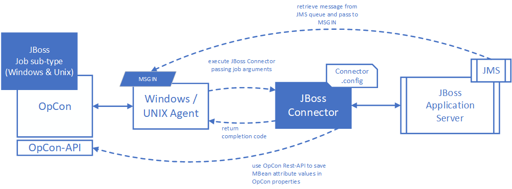

# JBoss Connector

Current version is 26.0.0.

The JBoss connector implementation consists of a Java program that is executed by either a Windows or UNIX/LINUX Agent. 

The job definitions are defined as Windows or UNIX jobs using the JBoss job sub-type. When the job is scheduled by OpCon, the job definitions are passed as arguments to the JBoss Connector.

The JBoss Connector currently supports task types which are used to communicate with management beans (mbeans) and JMS queues within the JBoss environment. Definitions are created by using either the JBoss Windows or UNIX job sub-types. The job definitions are then submitted to the connector as arguments when the agent executes the connector. The connector performs the request and returns a positive result (return code 0) or a negative result (return code 1). 

The JBoss Connector has an Connector.config file that is used to define general information as well as the connection information for the target JBoss environment. The connection information includes the JBoss server address, the port numbers to be used for administration and application access as well as user and password definitions to be used when accessing management components or JMS queues.

If the request is to retrieve a message from a JMS queue, the retrieved message should contain a valid OpCon event definition (without user and password). The event will be written into a file and the file will be written into the MSGIN directory associated with the installed Windows or UNIX/LINUX Agent. The OpCon event user code and password is retrieved from the Agent.config file and added to the retrieved event.

JBoss Connector supports the following Operations

Operation       | Description
--------------- | -----------
**invoke**      | Executes a defined operation associated with the mbean.
**polledquery** | Performs a lookup of an attribute associated with the mbean checking for a specific value.
**query**       | Retrieves the value of an attribute associated with the mbean and optionally saves the value within an OpCOn property.
**retrievemsg** | Retrieves a message from a JMS queue.
**sendmsg**     | Submits a message to a JMS queue.
**update**      | Updates the value of the attribute associated with the mbean (attribute must be writable).
