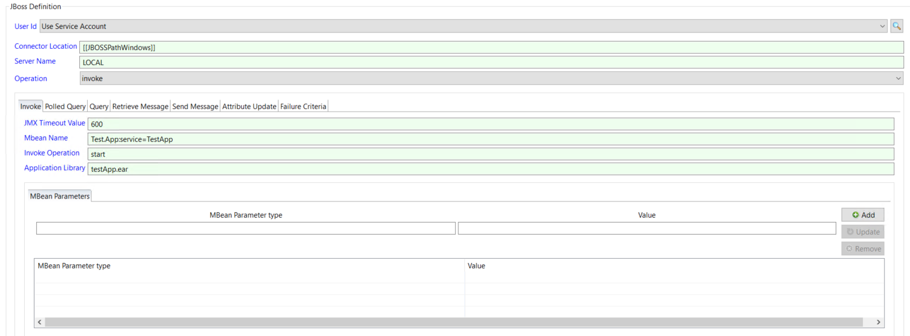
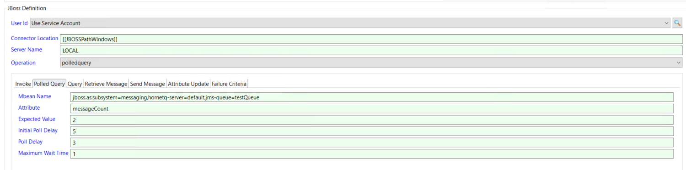
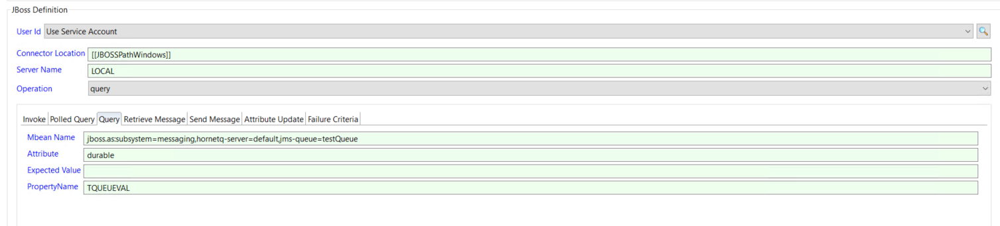
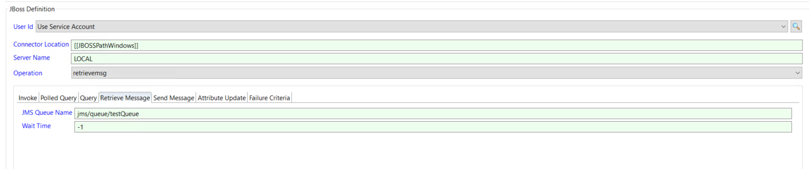
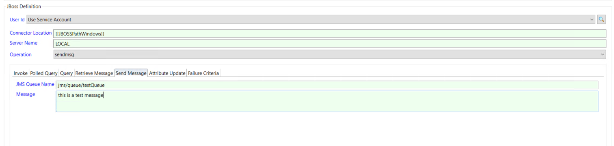
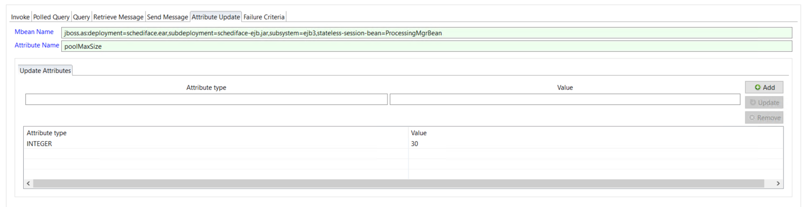

# Task Definitions

The Enterprise Manager includes job sub-type definitions for the JBoss Connector for both a Windows and a UNIX environment. The job sub-types can be accessed by selecting the JBoss job sub-type from the drop down list when the Windows or the UNIX Job Type has been selected. 

## JBoss Job definitions
The JBoss definition, defines the operations that can be executed by the JBoss Connector. These operations require the name of a global property that contains the location of the connector installation and the name of the server to submit the request to. 

### The JBoss invoke operation definition
The invoke operation executes a defined Operation associated with the mbean. It is possible to pass parameters when executing the Operation of the mbean. Currently string, integer, long and boolean values are supported as parameters. 

The execution returns a 0 (FINISHED_OK) to indicate successful completion or a 1 (FAILED) if an error occurred. This means that to check for a successful completion, the Failure Criteria should be set to NE (Not Equal) to 0.

Field                       | Description
--------------------------- | -----------
**Connector Location**      | Required field and contains the installed location of the JBoss Connector. This should not be changed and the location should be defined in the JBOSSPathWindows or JBOSSPathUnix properties. If more than one JBoss Connectors are installed a new global property should be defined for each connector and the entry in this field updated.
**Server Name**             | Required field and contains the name of the JBoss server that the request must be routed to. The name must match a value in the [server name] header field of the Connector.config file.
**Operation**               | Required field and contains the operation that the connector should perform (**invoke**). 
**JMX Timeout Value**       | Optional field that defines the maximum time in seconds to wait for the JMX request to complete. Default value is 60.
**Mbean Name**              | Required field and contains the full name of the mbean that the invoke operation will be submitted to.
**Invoke Operation**        | Required field and contains the name of the Operation of the mbean that the connector should invoke.
**Application Library**     | Optional field that defines application libraries that must be added to the connector classpath for the request to complete successfully. Can be either a .jar or .ear file. Multiple values can be entered by using a comma as a separator character.
**Mbean Parameter**         | Optional field that contains parameters to be passed when performing the defined mbean operation, enter the parameter identifier in the Mbean Parameter Type field and the Value in the Value field. 

The following parameter types are supported: STRING, INTEGER, LONG and BOOLEAN.
To add a parameter, enter the definitions and select the Add button. The Parameter will then be added to the parameter list.
To update a parameter in the parameter list, select the parameter in the list, change the value and select the Update button.
To remove a parameter from the Parameter List, select the parameter in the list and select the Remove button.
The parameters are passed to the connector within a single string separated by a semi colon (STRING=test;INTEGER=12)

### The JBoss polledquery operation definition
The polledquery operation performs a lookup of an attribute of the management bean (mbean) matching the retrieved mbean value to an expected value defined as part of the job definition. If the values do not match, the connector will wait for a configured amount of time and retrieve the attribute value again performing the match. Depending on the definitions, the connector can perform this check until the expected value is retrieved from the mbean or until a wait time expires.

The execution returns a 0 (FINISHED_OK) if a match occurs, or a 1 (FAILED) if no match occurs within the specified wait time or an error occurs. This means that to check for a successful completion, the Failure Criteria should be set to NE (Not Equal) to 0.

Field                       | Description
--------------------------- | -----------
**Connector Location**      | Required field and contains the installed location of the JBoss Connector. This should not be changed and the location should be defined in the JBOSSPathWindows or JBOSSPathUnix properties. If more than one JBoss Connectors are installed a new global property should be defined for each connector and the entry in this field updated.
**Server Name**             | Required field and contains the name of the JBoss server that the request must be routed to. The name must match a value in the [server name] header field of the Connector.config file.
**Operation**               | Required field and contains the operation that the connector should perform (**polledquery**). 
**Mbean Name**              | Required field and contains the full name of the mbean that the polledquery operation will be submitted to.
**Attribute**               |Required field and contains the name of the Attribute of the mbean that the connector should retrieve the value of.
**Expected Value**          | Required field and contains the expected value of the retrieved attribute. The connector performs a match between the expected value and the retrieved value of the attribute.
**Initial Poll Delay**      | Optional field that defines the amount of time in seconds to wait before performing the first lookup of the mbean attribute. The default value is 10. A value of 0 is not allowed.
**Poll Delay**              | Optional field that defines the amount of time in seconds to wait between performing lookups of the mbean attribute. The default value is 5. A value of 0 is not allowed.
**Maximum Wait Time**       | Optional field that defines the amount of time in minutes to wait for a match between the expected value and the value retrieved from the attribute before returning a time out condition. The default value is 1. A value of 0 is not allowed.

### The JBoss query operation definition

The query operation performs a lookup of an attribute of the management bean (mbean). The query operation has multiple capabilities depending on the arguments submitted as part of the JMX request. 
- Mbean Name and Attribute fields defined results in the value of the attribute displayed in the job log.
- Mbean Name, Attribute and Expected Value fields defined results in a check to see if there is a match between the mbean value and the expected value.
- Mbean Name, Attribute and Property Name fields results in the attribute value being saved in the OpCon property. 

If  performing a match, the execution returns a 0 (FINISHED_OK). If the values do not match the execution returns a 1 (FAILED).
Otherwise a 0 (FINISHED_OK) is returned or 1 (FAILED) if the execution causes an error condition..

Field                       | Description
--------------------------- | -----------
**Connector Location**      | Required field and contains the installed location of the JBoss Connector. This should not be changed and the location should be defined in the JBOSSPathWindows or JBOSSPathUnix properties. If more than one JBoss Connectors are installed a new global property should be defined for each connector and the entry in this field updated.
**Server Name**             | Required field and contains the name of the JBoss server that the request must be routed to. The name must match a value in the [server name] header field of the Connector.config file.
**Operation**               | Required field and contains the operation that the connector should perform (**query**). 
**Mbean Name**              | Required field and contains the full name of the mbean that the query operation will be submitted against.
**Attribute**               | Required field and contains the name of the attribute of the mbean that the connector should retrieve the value of.
**Expected Value**          | Optional field and if defined contains the expected value of the retrieved attribute. The connector performs a match between the expected value and the retrieved value of the attribute.
**Property Name**           | Optional field na dif defined contains the OpCon property to save the attribute value in. The property name can be either global or instance properties. When using instance properties the full definition including date, schedule name, etc must be used. If the property does not exist, it is created.

### The JBoss retrievemsg operation definition
The retrievemsg operation retrieves a message from the specified JMS queue and places the retrieved message in the MSGIN directory of the associated Agent. It is possible for the connector to return immediately if no message is available, to wait for a period of time or to wait indefinitely for a message to arrive on the JMS queue. The retrieved message should be a properly formatted OpCon event without a user code and password.

The location of the MSGIN directory as well as the OpCon user code and user password that must be used when submitting the event are defined in the Connector.config file.

If a message is retrieved and submitted to OpCon as an event, the execution returns a 0 (FINISHED_OK). If no message is available or the wait time expires, the execution returns a 1 (FAILED). This means that to check for a successful completion, the Failure Criteria should be set to NE (Not Equal) to 0.

Field                       | Description
--------------------------- | -----------
**Connector Location**      | Required field and contains the installed location of the JBoss Connector. This should not be changed and the location should be defined in the JBOSSPathWindows or JBOSSPathUnix properties. If more than one JBoss Connectors are installed a new global property should be defined for each connector and the entry in this field updated.
**Server Name**             | Required field and contains the name of the JBoss server that the request must be routed to. The name must match a value in the [server name] header field of the Connector.config file.
**Operation**               | Required field and contains the operation that the connector should perform (**retrievemsg**). 
**JMS Queue Name**          | Required field and contains the name of the JMS queue to send the message to. The format of the name should start with the 'jms/' value.
**Wait Time**               | Optional field and contains wait time associated with the retrieval request. Value 0 - do not wait (default), -1 wait for a message to arrive, n is wait time in minutes.

### The JBoss sendmsg operation definition
The sendmsg operation places the message defined in the job definition on the specified JMS queue. If the message is placed on the JMS queue, the execution returns a 0 (FINISHED_OK). If an error occurs, the execution returns a 1 (FAILED). This means that to check for a successful completion, the Failure Criteria should be set to NE (Not Equal) to 0.

Field                       | Description
--------------------------- | -----------
**Connector Location**      | Required field and contains the installed location of the JBoss Connector. This should not be changed and the location should be defined in the JBOSSPathWindows or JBOSSPathUnix properties. If more than one JBoss Connectors are installed a new global property should be defined for each connector and the entry in this field updated.
**Server Name**             | Required field and contains the name of the JBoss server that the request must be routed to. The name must match a value in the [server name] header field of the Connector.config file.
**Operation**               | Required field and contains the operation that the connector should perform (**sendmsg**). 
**JMS Queue Name**          | Required field and contains the name of the JMS queue to send the message to. The format of the name should start with the 'jms/' value.
**Message**                 | Required field and contains the message to place on the associated JMS queue.

### The JBoss update operation definition

The update operation updates the value of an attribute associated with the the management bean (mbean). The attribute must be defined as writable to update the value.

The execution returns a 0 (FINISHED_OK) if the attribute was successfully updated, or a 1 (FAILED) if the update failed. This means that to check for a successful completion, the Failure Criteria should be set to NE (Not Equal) to 0.

Field                       | Description
--------------------------- | -----------
**Connector Location**      | Required field and contains the installed location of the JBoss Connector. This should not be changed and the location should be defined in the JBOSSPathWindows or JBOSSPathUnix properties. If more than one JBoss Connectors are installed a new global property should be defined for each connector and the entry in this field updated.
**Server Name**             | Required field and contains the name of the JBoss server that the request must be routed to. The name must match a value in the [server name] header field of the Connector.config file.
**Operation**               | Required field and contains the operation that the connector should perform (**update**). 
**Mbean Name**              | Required field and contains the full name of the mbean that the query operation will be submitted against.
**Attribute Name**          | Required field and contains the name of the attribute of the mbean that should be updated.
**Update Attributes**       | Required field and contains the attribute type and value to update.

The following attribute types are supported: STRING, LSTRING, INTEGER, LONG and BOOLEAN.
To add an attribute update, enter the definitions and select the Add button. The attribute update will then be added to the parameter list.
To update an attribute in the attribute list, select the attribute type in the list, change the value and select the Update button.
To remove an attribute from the Parameter List, select the attribute type in the list and select the Remove button.
The attribute type is passed to the connector within a single string (STRING=test) except for LSTRING where the values are comma separated (LSTRING=test,test1)
