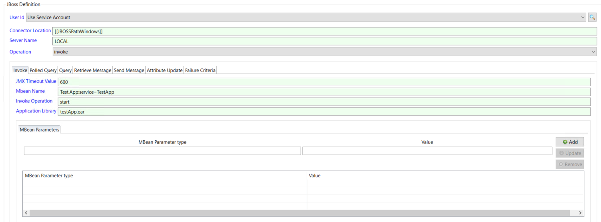
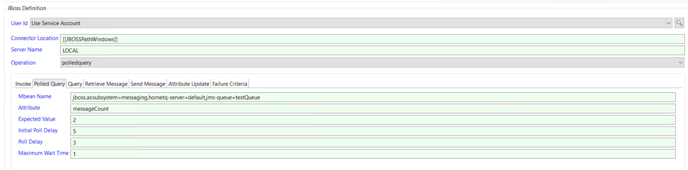
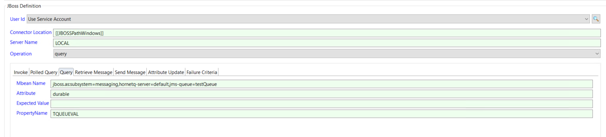
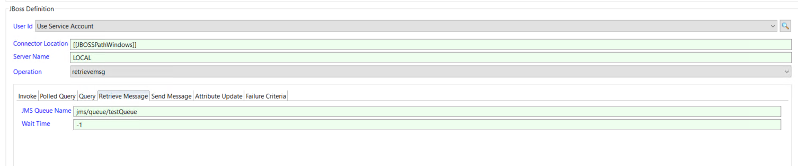
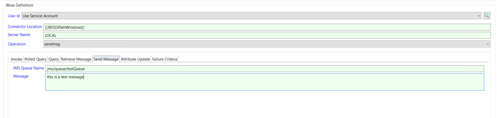
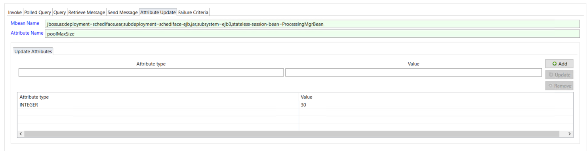

# Task definitions

## What is it?

The Enterprise Manager includes job sub-type definitions for the JBoss Connector for both Windows and UNIX environments. The job sub-types are accessed by selecting the **JBoss** job sub-type from the list when the Windows or UNIX job type is selected.

- Use these job sub-types when building OpCon jobs that interact with JBoss EAP management beans (mbeans) or JMS queues
- Use the **invoke** operation to run a management operation on an mbean
- Use the **polledquery** operation to wait for an mbean attribute to reach a specific value before continuing a workflow
- Use the **query** operation to retrieve an mbean attribute value once, optionally comparing it or saving it to an OpCon property
- Use the **retrievemsg** or **sendmsg** operations to interact with JMS queues

## JBoss job definitions

The JBoss job definition defines the operations that the JBoss Connector can run. These operations require the name of a global property that contains the location of the connector installation and the name of the server to submit the request to.

### Invoke operation

The invoke operation runs a defined operation associated with an mbean. It is possible to pass parameters when running the operation. `STRING`, `INTEGER`, and `LONG` values are supported as parameters.

The operation returns `0` (FINISHED_OK) to indicate successful completion or `1` (FAILED) if an error occurred. To detect failures, set the **Failure Criteria** to NE (Not Equal) to `0`.

| Field | Description |
| --- | --- |
| **Connector Location** | Required. Contains the installed location of the JBoss Connector. This should not be changed; the location should be defined in the `JBOSSPathWindows` or `JBOSSPathUnix` global property. If more than one JBoss Connector is installed, define a new global property for each connector and update this field accordingly |
| **Server Name** | Required. The name of the JBoss server that the request must be routed to. The name must match a value in the `[server name]` header field of the `Connector.config` file |
| **Operation** | Required. The operation for the connector to perform (**invoke**) |
| **JMX Timeout Value** | Optional. The maximum time in seconds to wait for the JMX request to complete. Only values **greater than 60** take effect; a value of 60 or less is ignored. Leave the field empty to apply no timeout from the connector. There is no default |
| **Mbean Name** | Required. The full name of the mbean that the invoke operation will be submitted to |
| **Invoke Operation** | Required. The name of the operation on the mbean that the connector should invoke |
| **Application Library** | Optional. Application libraries that must be added to the connector classpath for the request to complete successfully. Can be either a `.jar` or `.ear` file. Separate multiple values with a comma |
| **Mbean Parameter** | Optional. Parameters to pass when performing the mbean operation. Enter the parameter identifier in the **Mbean Parameter Type** field and the value in the **Value** field |

The following parameter types are supported: `STRING`, `INTEGER`, and `LONG`.

:::caution

Do not use a `BOOLEAN` parameter type with the invoke operation. The connector accepts the type but cannot convert the value, so the job fails. Use the update operation if you need to set a boolean value on an mbean.

:::

To add a parameter, enter the definitions and select the **Add** button. The parameter is added to the parameter list.

To update a parameter in the parameter list, select the parameter in the list, change the value, and select the **Update** button.

To remove a parameter from the parameter list, select the parameter in the list and select the **Remove** button.

Parameters are passed to the connector as a single string separated by a semicolon (example: `STRING=test;INTEGER=12`).

### Polledquery operation

The polledquery operation retrieves an attribute of an mbean and compares it to an expected value. If the values do not match, the connector waits for a configured time and retrieves the attribute value again. Depending on the configuration, the connector continues this check until the expected value is retrieved or until a wait time expires.

The operation returns `0` (FINISHED_OK) if a match occurs, or `1` (FAILED) if no match occurs within the specified wait time or if an error occurs. To detect failures, set the **Failure Criteria** to NE (Not Equal) to `0`.

| Field | Description |
| --- | --- |
| **Connector Location** | Required. Contains the installed location of the JBoss Connector. This should not be changed; the location should be defined in the `JBOSSPathWindows` or `JBOSSPathUnix` global property |
| **Server Name** | Required. The name of the JBoss server that the request must be routed to. The name must match a value in the `[server name]` header field of the `Connector.config` file |
| **Operation** | Required. The operation for the connector to perform (**polledquery**) |
| **Mbean Name** | Required. The full name of the mbean that the polledquery operation will be submitted to |
| **Attribute** | Required. The name of the attribute on the mbean that the connector should retrieve |
| **Expected Value** | Required. The expected value of the retrieved attribute. The connector compares this value to the retrieved attribute value |
| **Initial Poll Delay** | Optional. The amount of time in seconds to wait before performing the first lookup of the mbean attribute. Default: `10`. A value of `0` is not allowed |
| **Poll Delay** | Optional. The amount of time in seconds to wait between lookups of the mbean attribute. Default: `5`. A value of `0` is not allowed |
| **Maximum Wait Time** | Optional. The amount of time in minutes to wait for a match before returning a timeout condition. Default: `1`. A value of `0` is not allowed |

### Query operation

The query operation retrieves an attribute of an mbean. The operation has multiple behaviors depending on the fields provided:

- **Mbean Name** and **Attribute** only — displays the attribute value in the job log
- **Mbean Name**, **Attribute**, and **Expected Value** — compares the mbean value to the expected value
- **Mbean Name**, **Attribute**, and **Property Name** — saves the attribute value to an OpCon property

If performing a match, the operation returns `0` (FINISHED_OK) when values match. If the values do not match, the operation returns `1` (FAILED). If no match is configured, the operation returns `0` (FINISHED_OK) or `1` (FAILED) if an error occurs.

| Field | Description |
| --- | --- |
| **Connector Location** | Required. Contains the installed location of the JBoss Connector. This should not be changed; the location should be defined in the `JBOSSPathWindows` or `JBOSSPathUnix` global property |
| **Server Name** | Required. The name of the JBoss server that the request must be routed to. The name must match a value in the `[server name]` header field of the `Connector.config` file |
| **Operation** | Required. The operation for the connector to perform (**query**) |
| **Mbean Name** | Required. The full name of the mbean that the query operation will be submitted against |
| **Attribute** | Required. The name of the attribute on the mbean that the connector should retrieve |
| **Expected Value** | Optional. If defined, contains the expected value of the retrieved attribute. The connector compares the expected value to the retrieved attribute value |
| **Property Name** | Optional. If defined, contains the OpCon property where the attribute value will be saved. The property name can be either a global or instance property. When using instance properties, include the full definition including date, schedule name, and so on. If the property does not exist, it is created |

### Retrievemsg operation

The retrievemsg operation retrieves a message from a specified JMS queue and places the retrieved message in the MSGIN directory of the associated agent. The connector can return immediately if no message is available, wait for a period of time, or wait indefinitely for a message to arrive.

The retrieved message must be a properly formatted OpCon event without a user code and password. The MSGIN directory location and the OpCon user code and password used when submitting the event are defined in the `Connector.config` file.

If a message is retrieved and submitted to OpCon as an event, the operation returns `0` (FINISHED_OK). If no message is available or the wait time expires, the operation returns `1` (FAILED). To detect failures, set the **Failure Criteria** to NE (Not Equal) to `0`.

| Field | Description |
| --- | --- |
| **Connector Location** | Required. Contains the installed location of the JBoss Connector. This should not be changed; the location should be defined in the `JBOSSPathWindows` or `JBOSSPathUnix` global property |
| **Server Name** | Required. The name of the JBoss server that the request must be routed to. The name must match a value in the `[server name]` header field of the `Connector.config` file |
| **Operation** | Required. The operation for the connector to perform (**retrievemsg**) |
| **JMS Queue Name** | Required. The name of the JMS queue to retrieve the message from. The format of the name must start with `jms/` |
| **Wait Time** | Optional. The wait time associated with the retrieval request. `0` = do not wait (default), `-1` = wait indefinitely for a message to arrive, `n` = wait time in minutes |

### Sendmsg operation

The sendmsg operation places a message on a specified JMS queue. If the message is placed on the JMS queue, the operation returns `0` (FINISHED_OK). If an error occurs, the operation returns `1` (FAILED). To detect failures, set the **Failure Criteria** to NE (Not Equal) to `0`.

| Field | Description |
| --- | --- |
| **Connector Location** | Required. Contains the installed location of the JBoss Connector. This should not be changed; the location should be defined in the `JBOSSPathWindows` or `JBOSSPathUnix` global property |
| **Server Name** | Required. The name of the JBoss server that the request must be routed to. The name must match a value in the `[server name]` header field of the `Connector.config` file |
| **Operation** | Required. The operation for the connector to perform (**sendmsg**) |
| **JMS Queue Name** | Required. The name of the JMS queue to send the message to. The format of the name must start with `jms/` |
| **Message** | Required. The message to place on the associated JMS queue |

### Update operation

The update operation updates the value of an attribute associated with an mbean. The attribute must be defined as writable to update the value.

The operation returns `0` (FINISHED_OK) if the attribute was successfully updated, or `1` (FAILED) if the update failed. To detect failures, set the **Failure Criteria** to NE (Not Equal) to `0`.

| Field | Description |
| --- | --- |
| **Connector Location** | Required. Contains the installed location of the JBoss Connector. This should not be changed; the location should be defined in the `JBOSSPathWindows` or `JBOSSPathUnix` global property |
| **Server Name** | Required. The name of the JBoss server that the request must be routed to. The name must match a value in the `[server name]` header field of the `Connector.config` file |
| **Operation** | Required. The operation for the connector to perform (**update**) |
| **Mbean Name** | Required. The full name of the mbean that the update operation will be submitted against |
| **Attribute Name** | Required. The name of the attribute on the mbean that should be updated |
| **Update Attributes** | Required. The attribute type and value to update |

The following attribute types are supported: `STRING`, `LSTRING`, `INTEGER`, and `BOOLEAN`.

For a `BOOLEAN` attribute, enter the value as `TRUE` in uppercase to set the attribute to true. **Any other value, including a lowercase `true`, sets the attribute to false.** The job still completes successfully, so check the case of the value if an attribute does not change as expected.

:::caution

Do not use a `LONG` attribute type with the update operation. The connector accepts the type but cannot convert the value, so the job fails. Use `INTEGER` for whole-number attributes within its range.

:::

To add an attribute update, enter the definitions and select the **Add** button. The attribute update is added to the parameter list.

To update an attribute in the list, select the attribute type in the list, change the value, and select the **Update** button.

To remove an attribute from the list, select the attribute type in the list and select the **Remove** button.

The attribute type is passed to the connector as a single string (examples: `STRING=test`, `BOOLEAN=TRUE`) except for `LSTRING` where values are comma-separated (example: `LSTRING=test,test1`).

## FAQs

**What return codes does the JBoss Connector use?**
The connector returns exit code `0` (FINISHED_OK) for successful operations and `1` (FAILED) for errors or unmet conditions. Set the job's **Failure Criteria** to NE (Not Equal) to `0` to detect failures correctly.

**Which operation should I use to wait for a JBoss server state to change?**
Use the **polledquery** operation. It retrieves an mbean attribute repeatedly at a configured interval until the value matches the expected value or the maximum wait time expires.

**Which operation should I use to read an mbean attribute value once?**
Use the **query** operation. You can display the value in the job log, compare it to an expected value, or save it to an OpCon property.

**How do I pass multiple parameters to the invoke operation?**
Enter each parameter in the **Mbean Parameter** fields and select the **Add** button to add it to the list. Parameters are passed to the connector as a single semicolon-separated string (example: `STRING=test;INTEGER=12`).

**What JMS queue name format is required for retrievemsg and sendmsg?**
The **JMS Queue Name** field must start with `jms/` (example: `jms/myQueue`).

**Can I save a query result to an OpCon property?**
Yes. Enter the property name in the **Property Name** field of the query operation. Use a global property name or a full instance property definition. If the property does not exist, the connector creates it.

## Glossary

**Mbean (Management Bean)** — A Java object that implements the JMX specification and exposes management operations and attributes for a JBoss EAP component. The JBoss Connector communicates with mbeans to invoke operations, retrieve attribute values, and update attribute values.

**JMX (Java Management Extensions)** — A Java technology for managing and monitoring applications. The JBoss Connector uses the JMX protocol to communicate with JBoss EAP management interfaces.

**JMS (Java Message Service)** — A Java API for accessing message-oriented middleware. The JBoss Connector uses JMS for the retrievemsg and sendmsg operations.

**JMS Queue** — A named message buffer within JBoss EAP that holds messages for asynchronous processing. Use the full `jms/` prefix when specifying queue names in job definitions.

**Invoke** — A JBoss Connector operation that runs a defined method on an mbean.

**PolledQuery** — A JBoss Connector operation that repeatedly retrieves an mbean attribute value and compares it to an expected value until a match occurs or a maximum wait time expires.

**Query** — A JBoss Connector operation that retrieves an mbean attribute value once, with options to display it in the job log, compare it to an expected value, or save it to an OpCon property.

**RetrieveMsg** — A JBoss Connector operation that retrieves a message from a JMS queue and places it in the agent's MSGIN directory as an OpCon event.

**SendMsg** — A JBoss Connector operation that places a message on a JMS queue.

**Update** — A JBoss Connector operation that modifies the value of a writable attribute on an mbean.

**FINISHED_OK** — The exit code `0` returned by the JBoss Connector to indicate that an operation completed successfully.

**FAILED** — The exit code `1` returned by the JBoss Connector to indicate that an operation encountered an error or an expected condition was not met.
